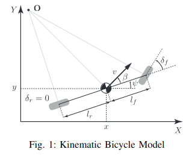

# $$\text{Formulas Odometría}$$
Nomenclatura utilizada:
- $v$: Velocidad del coche.
- $x$: Posición en el eje $x$.
- $y$: Posición en el eje $y$.
- $\theta$: Ángulo absoluto respecto de la posición inicial.
- $\delta$: Ángulo de las ruedas respeto del ángulo $\theta$.

Datos que podemos recoger:
- $v_x$: Velocidad del coche en el eje $x$.
- $\delta$: Ángulo de las ruedas del coche.

### Modelo Cinemático de Bicicleta

Para realizar los cálculos de odometría nos basamos en el modelo cinemático de la bicicleta.

 

 
 

Para este modelo utilizamos tres fases:

1. Recoger datos del simulador.
2. Realizar los cálculos.
3. Actualizar los estados.

Esto se repetirá cada vez que el código se ejecute.

### Primera Fase

El primer paso puede ser omitido en la explicación ya que es programar el código para recoger los datos, sin tener que realizar cálculos.

### Segunda Fase

Calculamos la velocidad $v$ a partir de $v_x$ utilizando el ángulo $\theta$:

$$v = \dfrac{v_x}{\cos{(\beta + \theta)}}$$

Calculamos los diferenciales de cada estado:

- $dx = v \cdot \cos{(\beta + \theta)}$
- $dy = v \cdot \sin{(\beta + \theta)}$
- $d\theta = \dfrac{v}{l_r} \cdot \sin{(\beta)}$

Para calcular $\beta$ utlizamos:

$$\beta = \arctan{\left( \dfrac{l_r}{l_r + l_f} \cdot \tan{(\delta)} \right)}$$

Siendo $l_r$ la distancia entre las ruedas traseras y el punto de referencia, $l_f$ la distancia entre las ruedas delanteras y el punto de referencia, y $\delta$ el ángulo de las ruedas delanteras.

### Tercera Fase

Actualizamos cada estado:

- $x = x_{t-1} + dx \cdot \Delta t$
- $y = y_{t-1} + dy \cdot \Delta t$
- $\theta = \theta_{t-1} + d\theta \cdot \Delta t$

